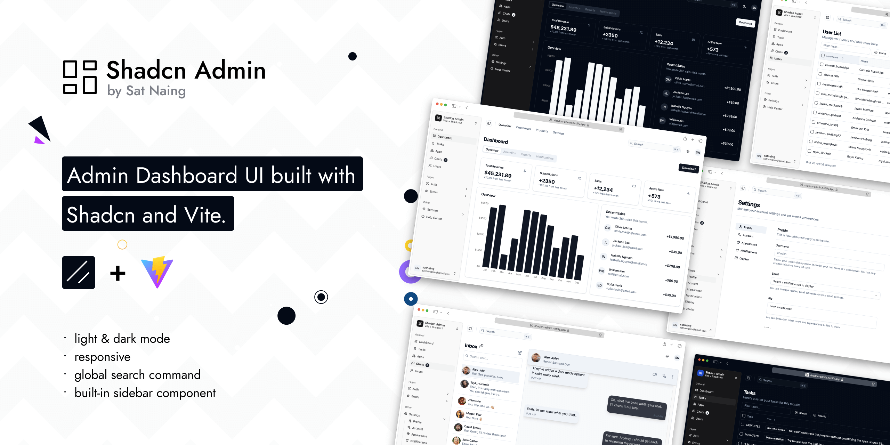

# 🚀 Vite React TanStack Router Shadcn Admin

Admin Dashboard UI xây dựng với Vite, React, pnpm, TanStack Router, shadcn/ui, TailwindCSS và RadixUI. Dự án hướng đến sự hiện đại, dễ mở rộng, responsive, và dễ phát triển.

## 🖼️ Ảnh minh hoạ



## ✨ Features

- 🌗 Giao diện sáng/tối (Light/Dark mode)
- 📱 Responsive trên mọi thiết bị
- 📚 Sidebar và Global Search
- 🗂️ 10+ trang mẫu
- 🧩 Nhiều custom components
- 🗺️ Quản lý route với TanStack Router
- 🔒 TypeScript strict mode
- 🧹 Linting và Formatting tự động

## 🛠️ Công nghệ sử dụng

| Công nghệ            | Mô tả/Chức năng                |
|---------------------|--------------------------------|
|  | Thư viện UI chính |
|  | Ngôn ngữ lập trình |
|  | Công cụ build siêu nhanh |
|  | Bộ UI hiện đại |
|  | Routing mạnh mẽ |
|  | Quản lý state |
|  | Xử lý form |
|  | Validation schema |
|  | Lint code |
|  | Định dạng code |
|  | Icon đẹp, hiện đại |
|  | Bộ icon mở rộng |
|  | Quản lý package |

## Cài đặt và chạy dự án

Clone về máy:
```bash
git clone <repo-url>
cd <tên-thư-mục>
```

Cài dependencies:
```bash
pnpm install
```

Chạy local:
```bash
pnpm dev
```

Build production:
```bash
pnpm build
```

## 📁 Project Structure

```
├── public/                 # Tài nguyên tĩnh, ảnh, favicon, ...
├── src/                    # Mã nguồn chính
│   ├── assets/             # Tài nguyên tĩnh dùng trong code (ảnh, svg, ...)
│   ├── components/         # Các component tái sử dụng (UI, layout, widget)
│   ├── config/             # Cấu hình chung cho app (ví dụ: theme, constants)
│   ├── context/            # React context (global state, provider)
│   ├── features/           # Các module/tính năng lớn (theo domain)
│   │   ├── apps/           # Quản lý ứng dụng con hoặc tích hợp
│   │   ├── auth/           # Xác thực, đăng nhập, đăng ký, quên mật khẩu, OTP
│   │   │    ├── sign-in/, sign-up/, forgot-password/, otp/ # Từng flow xác thực riêng biệt
│   │   │    └── auth-layout.tsx      # Layout cho các trang xác thực
│   │   ├── chats/          # Quản lý chat, tin nhắn
│   │   ├── dashboard/      # Trang tổng quan, thống kê
│   │   ├── errors/         # Trang và logic xử lý lỗi
│   │   ├── settings/       # Cấu hình tài khoản, giao diện, thông báo
│   │   │    ├── account/, appearance/, display/, notifications/, profile/ # Các module nhỏ của settings
│   │   ├── tasks/          # Quản lý công việc, nhiệm vụ
│   │   ├── users/          # Quản lý người dùng
│   │   │    ├── components/  # Component riêng cho users
│   │   │    ├── context/     # Context riêng cho users
│   │   │    ├── data/        # Dữ liệu mẫu, mock data cho users
│   │   │    └── index.tsx    # Entry point cho module users
│   │   └── ...
│   │   
│   │   # Các module features thường có cấu trúc lồng nhau:
│   │   #   components/: UI riêng cho module
│   │   #   context/: React context riêng
│   │   #   data/: Dữ liệu mẫu, mock data
│   │   #   index.tsx: Điểm vào module (export, page chính)
│   ├── hooks/              # Custom React hooks
│   ├── lib/                # Thư viện, hàm tiện ích dùng chung
│   ├── routes/             # Định nghĩa các routes, trang
│   ├── stores/             # State management (Zustand, v.v.)
│   ├── utils/              # Hàm tiện ích nhỏ
│   ├── index.css           # File CSS gốc
│   ├── main.tsx            # Điểm vào ứng dụng React
│   ├── routeTree.gen.ts    # File routes tự sinh
│   └── vite-env.d.ts       # TypeScript env definitions
├── index.html              # File HTML gốc
├── package.json            # Thông tin, scripts, dependencies
├── pnpm-lock.yaml          # File lock cho pnpm
├── vite.config.ts          # Cấu hình Vite
├── tsconfig*.json          # Cấu hình TypeScript
├── .gitignore              # File ignore cho git
└── README.md               # Tài liệu dự án
```

### Giải thích nhanh:
- **features/**: Chứa các module lớn, mỗi module là một domain/tính năng độc lập (auth, users, tasks, ...). Thường mỗi module sẽ có:
  - `components/`: Các UI component riêng cho module
  - `context/`: React context riêng cho module
  - `data/`: Dữ liệu mẫu, mock data
  - `index.tsx`: Entry point (export, page chính)
- **apps/**: Tích hợp ứng dụng con hoặc micro-app
- **auth/**: Đăng nhập, đăng ký, quên mật khẩu, xác thực OTP
- **chats/**: Quản lý chat, tin nhắn
- **dashboard/**: Trang tổng quan, thống kê
- **errors/**: Trang và logic xử lý lỗi
- **settings/**: Cấu hình tài khoản, giao diện, thông báo
- **tasks/**: Quản lý công việc, nhiệm vụ
- **users/**: Quản lý người dùng
- **components/**: Các UI component dùng lại nhiều nơi
- **routes/**: Định nghĩa route, trang chính
- **hooks/**: Custom hooks cho dự án
- **stores/**: Quản lý state (Zustand, v.v.)
- **context/**: Global context provider
- **utils/**, **lib/**: Hàm tiện ích, thư viện chung
- **config/**: Các file cấu hình riêng cho app

## Một số lệnh hữu ích

- `pnpm dev` — Chạy server phát triển
- `pnpm build` — Build production
- `pnpm lint` — Kiểm tra lint
- `pnpm format` — Format code

## Đóng góp
Pull request và issue luôn được hoan nghênh!

## 🙏 Acknowledgements

- Dựa trên cảm hứng từ [shadcn/ui](https://ui.shadcn.com/), [TanStack Router](https://tanstack.com/router/latest), [Vite](https://vitejs.dev/)
- Icon bởi [Tabler Icons](https://tabler.io/icons) & [Lucide](https://lucide.dev/)

## 📄 License
[MIT](./LICENSE)
  pnpm install
```

Start the server

```bash
  pnpm run dev
```


# vite-react-tanstackrouter-shadcn
